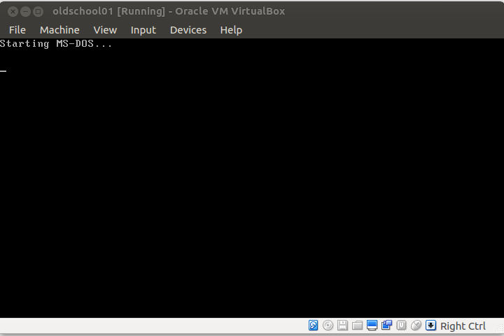
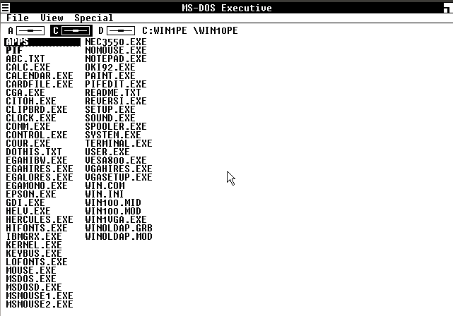
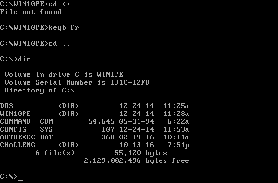
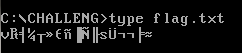

The best broths are cooked...
==============

On nous as fourni un fichier:
tu_l_as_vu.ova

Bon, ova je connais pas, google aide moi!
http://www.lmgtfy.com/?q=ova+file

OK, ca s'import dans virtualbox, tentons..



OK, OK, j'ai bien vu MS-DOS, ca va aller, ca peut etre pire...



OK, c'est pire. Bon, on fera avec, windows 1.0.

Premiere etape, fermer windows, on va se promener et voir c'qu'on as:
```
C:\WIN10PE>
```

Hum, et si on remonte:  


Ho, un dossier "challeng"(e) et dedans?
- challeng.bas
- flag.txt

Ah, ben c'etait facile, y'a qu'a cat, euh TYPE flag.txt et c'est bon!  


Damned, bon et edit challeng.bas ca donne quoi?
```
IF login$ <> "4Dministrat0Rzzzz" THEN
```

OK, on as le login, commence bien.

```
OPEN "flag.txt" FOR INPUT AS #1
INPUT #1, flag$

....

IF LEN(flag$) <> LEN(pass$) THEN

....

a$ = MID$(flag$, i, 1)
b$ = MID$(login$, i, 1)
c$ = MID$(pass$, i, 1)

....

IF c$ <> CHR$(ASC(a$) - ASC(b$)) THEN
...
```
Donc, si je comprends bien le flag est de la meme longeur que le mot de passe.  
Le flag est dans le fichier flaz.txt.  
Le mot de passe qu'on cherche est la valeur ascii du login soustrait a la valeur ascii de flag. Simple, on as le flag et le login...

Mais comment choper la valeur ascii d'un fichier text sous dos?? euh...  
euh... (ca fait 20 ans que j'ai pas fait de DOS moi...)  
Ben ils le font bien dans le challenge... codons en BASIC:

```
OPEN "flag.txt" FOR INPUT AS #1
INPUT #1, flag$
for i = 1 to LEN(flag$)
 PRINT ASC(MID$(flag$, i, 1))
 NEXT i
```
Ce qui donne :
```
118
158
181
172
194
175
238
164
222
165
199
115
154
170
170
198
247
```

Bon, j'ai ce qu'il me faut, on va faire a suite en python hein....:

```
flag = [ 118, 158, 181, 172, 194, 175, 238, 164, 222, 165, 199, 115, 154, 170, 170, 198, 247]
login = "4Dministrat0Rzzzz"

i=0
for ch in login:
    print chr(flag[i] - ord(ch))
    i = i+1
```

Ce qui donne:
BZHCTF{0lDSCH00L}

\o/
