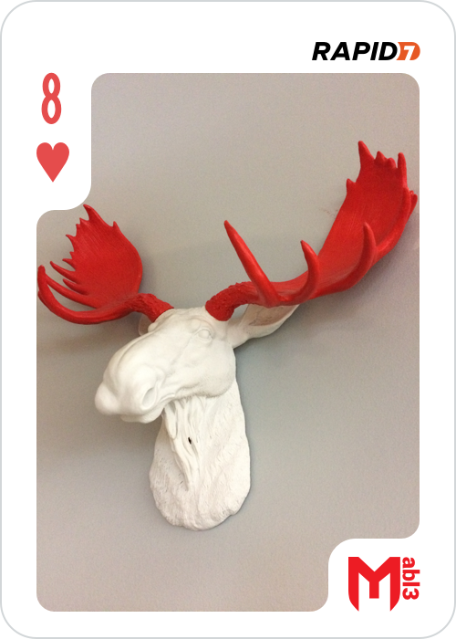
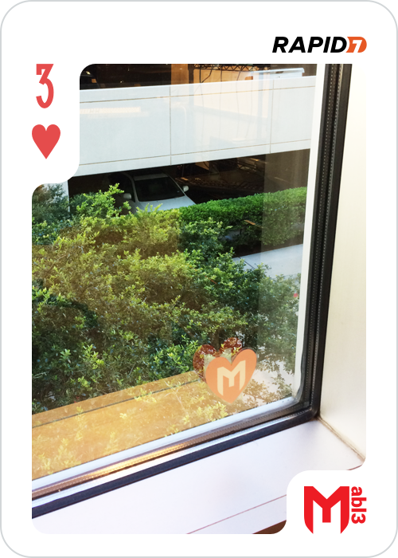

# MetaSploitable3 Community CTF

## 5 of hearts

Once the platform had started we did the usual things.  
The nmap scan showed an open port 80 so let's have a look there.

A quick ssh tunnel later and we have a directory listing, and a drupal folder.

On the drupal site we find and article called `I <3 High-Fives!` that contains a picture:  

Good start...

But the challenge mentions donuts and I can't see any here, seems like a classic steganography challenge to me.  
Zsteg to the rescue!

In the text fields we get a HYUGE base64 blob, which unsurprisingly turns in to a PNG when decoded.  

Ahh donuts, and a flag.

## 8 of hearts

While I was working of the 5 of hearts, my collegue who is a whiz at SQLI had gotten the database root password from the payroll_app.php  
So we had a look at the database and found the "super_secret_db", looks interesting.

One table called flags containing a blob...  
We downloaded it and ran binwalk. This yielded a zip file, an encrypted zip file.  
But we don't have a password.

Seeing as time was an issue I thought I'd run fcrackzip on it just in case while I looked around to see if it was hidden in the database.  
Turns out I didn't even get a chance to look, fcrackzip and the rockyou password list got it in just over a second:

## Getting on to the machine

So now it's time to look at the machine properly.  
Nmap shows a few interesting services:  
ProFTPD 1.3.5
Samba smbd 3.X - 4.X workgroup: WORKGROUP
WEBrick httpd 1.3.1 Ruby 2.3.5
UnrealIRCd

So we started at the beginning, ProFTPD 1.3.5  
exploit/unix/ftp/proftpd_modcopy_exec        2015-04-22       excellent  ProFTPD 1.3.5 Mod_Copy Command Execution

But it didn't work straight away :(  
We know we're looking at a machine running ubuntu, the default apache folder is /var/www/html and not /var/www.  
We now have a shell! We realized later there were easier ways and this didn't yield much.

We wanted a real user though, so we looked at the other services.  
We found the "UnrealIRCD 3.2.8.1 Backdoor Command Execution" module and proptly got a shell as boba_fett.  
We then quickly uploaded a key to his .ssh/authorized_keys and sshed in \o/

So, we have a user, we want root. uname -a and searchsploit revealed two privilege escalations using the overlayfs bug.
exploits/linux/local/37292.c && gcc = UID 0!

Now that we're root lets get to work.

## 8 of clubs

First things first, we ran `#find /home`, and damn that ubuntu user!  
So then we ran `#find /home | grep -v ubuntu` to find anything interesting, and interesting it was.

We get the flag for the 8 of clubs here:  
./anakin_skywalker/52/37/88/76/24/97/77/22/23/63/19/56/16/27/43/26/82/80/98/73/8_of_clubs.png

## 2 of spades

We also saw `./leia_organa/2_of_spades.pcapng`  
Copying this file to my local machine and opening it with wireshark we can see it's a voip call.
Wireshark has an option to listen to calls recoreded in the pcap:  
- Telephony - voip calls  
Listening to it we get the following url spelled out:  
https://imgur.com/gmThKFP

(This is almost the same as a challenge in the ringzer0team.com site so we breezed through it)

## 9 of diamonds

In kylo_ren's home folder is a "hidden" folder:  
`.secret_files`  
In this folder is an ISO, inside the ISO is the png

## 3 of hearts

The 3 of hearts was simply found in the /lost+found folder, no trickery other than needing root

## 10 of clubs

In artoo_detoo's home is a wav file. Our first reflexes were listening to it (unpleasant), spectrographic analysis (unfruitful), then binwalk.  
This flag is actually the one that took us the most time, in fact we lost so much time on this one that mubix almost beat us.

Binwalk gave us `Zlib compressed data, default compression`, not png, so we didn't probe any further at first.  
We looked in to lsb steganography of compressed wav formats and other esoteric things for over 3 hours before someone thought "fsck it, binwalk -e".
And there we have it:  
`3A:      PNG image data, 500 x 700, 8-bit/color RGBA, non-interlaced`

## Joker
 
A quick find command showed us all the png files available, including:
`/etc/joker.png`

Aha, easy flag right? well no, the MD5 hash didn't work..  
Looking at the picture we see it's a negative, so we'll just use convert:  
`$convert joker.png -negate joker2.png`

Nop, still not the right flag.

Inverting the image also changes the metadata so we'll be getting the wrong hash.  
(I even tried submiting the hashes backwards in case it was a trick)

In the end I used gimp, opened the file.  
Colors > Invert gives us the right picture.  
Then File > Export as..  
Save as joker2.png  
And here's the trick, untick all the options:  

The MD5 hash of this file was the flag.  
Turns out I was the first to find it, happy about that.
