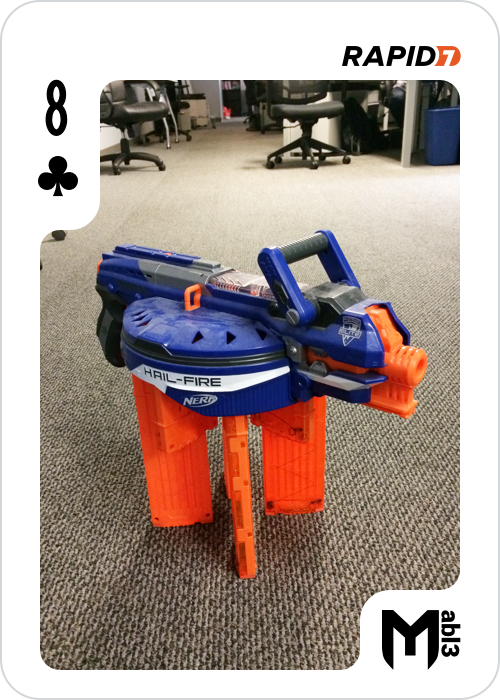
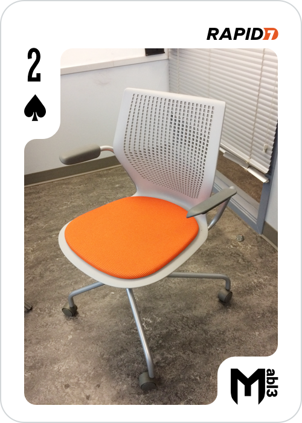
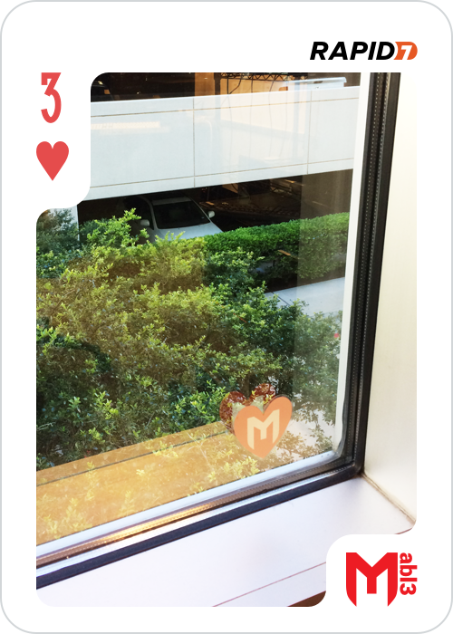
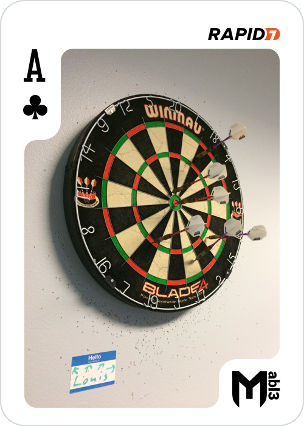
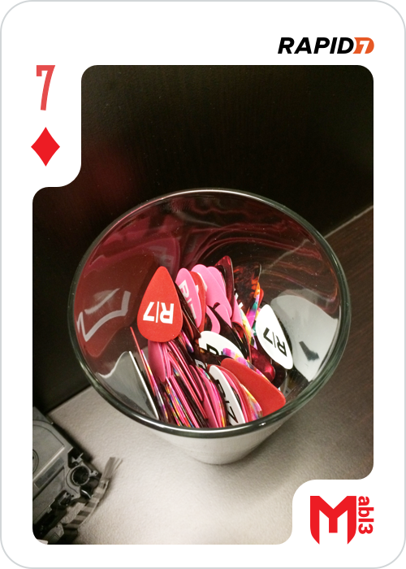
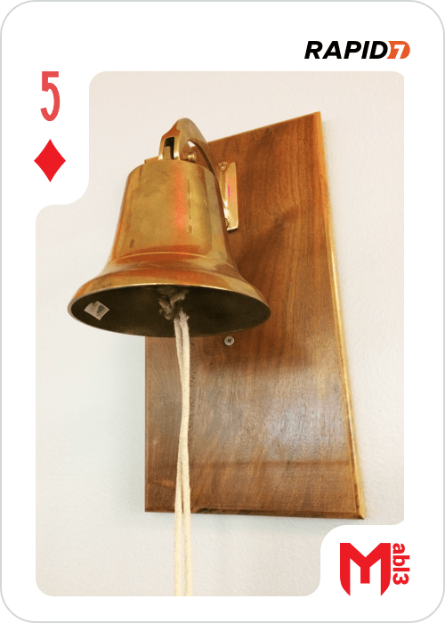

# MetaSploitable3 Community CTF

## 5 of hearts

Once the platform had started we did the usual things.
The nmap scan showed an open port 80 so let's have a look there.

A quick ssh tunnel later and we have a directory listing, and a drupal folder.

On the drupal site we find and article called `I <3 High-Fives!` that contains a picture:


Good start...

But the challenge mentions donuts and I can't see any here, seems like a classic steganography challenge to me.
Zsteg to the rescue!

In the text fields we get a HYUGE base64 blob, which unsurprisingly turns in to a PNG when decoded.


Ahh donuts, and a flag.

## 8 of hearts

While I was working of the 5 of hearts, my collegue who is a whiz at SQLI had
gotten the database root password from the payroll_app.php So we had a look at
the database and found the "super_secret_db", looks interesting.

One table called flags containing a blob...
We downloaded it and ran binwalk. This yielded a zip file, an encrypted zip file.
But we don't have a password.

Seeing as time was an issue I thought I'd run fcrackzip on it just in case
while I looked around to see if it was hidden in the database.  Turns out I
didn't even get a chance to look, fcrackzip and the rockyou password list got
it in just over a second:


## Getting on to the machine

So now it's time to look at the machine properly.
Nmap shows a few interesting services:
```
ProFTPD 1.3.5
Samba smbd 3.X - 4.X workgroup: WORKGROUP
WEBrick httpd 1.3.1 Ruby 2.3.5
UnrealIRCd
```

So we started at the beginning, `ProFTPD 1.3.5`:
```
exploit/unix/ftp/proftpd_modcopy_exec        2015-04-22       excellent  ProFTPD 1.3.5 Mod_Copy Command Execution
```

But it didn't work straight away :(
We know we're looking at a machine running ubuntu, the default apache folder is /var/www/html and not /var/www.
We now have a shell! We realized later there were easier ways and this didn't yield much.

We wanted a real user though, so we looked at the other services.
We found the `UnrealIRCD 3.2.8.1 Backdoor Command Execution` module and promptly got a shell as boba_fett.
We then quickly uploaded a key to his .ssh/authorized_keys and sshed in \o/

So, we have a user, we want root. `uname -a` and searchsploit revealed two privilege escalations using the overlayfs bug.
`exploits/linux/local/37292.c && gcc` = UID 0!

Now that we're root lets get to work.

## 8 of clubs

First things first, we ran `#find /home`, and damn that ubuntu user!
So then we ran `#find /home | grep -v ubuntu` to find anything interesting, and interesting it was.

We get the flag for the 8 of clubs here:
`./anakin_skywalker/52/37/88/76/24/97/77/22/23/63/19/56/16/27/43/26/82/80/98/73/8_of_clubs.png`



## 2 of spades

We also saw `./leia_organa/2_of_spades.pcapng`
Copying this file to my local machine and opening it with wireshark we can see it's a voip call.
Wireshark has an option to listen to calls recoreded in the pcap:
- Telephony - voip calls
Listening to it we get the following url spelled out:
[](https://imgur.com/gmThKFP)

(This is almost the same as a challenge in the ringzer0team.com site so we breezed through it)



## 9 of diamonds

In kylo_ren's home folder is a "hidden" folder:
`.secret_files`
In this folder is an ISO, inside the ISO is the png

## 3 of hearts

The 3 of hearts was simply found in the `/lost+found` folder, no trickery other than needing root




## 10 of clubs

In artoo_detoo's home is a wav file. Our first reflexes were listening to it (unpleasant), spectrographic analysis (unfruitful), then binwalk.
This flag is actually the one that took us the most time, in fact we lost so much time on this one that mubix almost beat us.

Binwalk gave us `Zlib compressed data, default compression`, not png, so we didn't probe any further at first.
We looked in to lsb steganography of compressed wav formats and other esoteric things for over 3 hours before someone thought "fsck it, binwalk -e".
And there we have it:
`3A:      PNG image data, 500 x 700, 8-bit/color RGBA, non-interlaced`


## King of spades

We saw the IRC server during the nmap scan, so I installed irssi on the metasploit machine.
When connecting to it the MOTD was a base64 encoded message, so I painfully copy / pasted it to my local machine, cleaned it up and decoded it.
Or at least I tried to, it seems we don't get the complete message from IRC.

One of our team who hadn't been working on the CTF until then and didn't know we had root used the boba_fett backdoor and cated the irdc.motd file.
A quick binwalk later and he got the flag.

## Ace of clubs

We were running out of easy flags to find do I started looking in to stuff we'd glossed over, like the chat bot.
My first reflex was to go and look at the source code to see what it does.
Inside chat_client.js I found a base64 blob and got the flag:



While playing around with the CTF later to see what I'd missed I saw the command injection possible and even the "easy" solution of just asking the bot for the flag.

## 7 of diamonds

We noticed a docker container running as well, when looking into it with `docker attach` we saw the zip file it contained.
Extracting this we get an encrypted zip file and a hint.gif.
As before I started up fcrackzip while I looked into the hint file.

The hint.gif turned out to be 313 seperate QR codes, we all know where this is heading.
Splitting up the gif into seperate files with `convert -coalesce hint.gif out%05d.pgm` and decoding the first on yields a png header (yep, knew that was coming).
so bash and zbarimg to the rescue:
```bash
$for i in ``ls``; do zbarimg -q --raw $i; done > temp_file
$cat temp | tr -d '\n' | xxd -r -p > 7_of_diamonds.png
```


With that password we can open the zip file and get:



## 10 of spades

While looking at the running processes we saw the readme_app.

We didn't really need to look into it as a find command in the folder gave us the flag:


## 5 of diamonds

Another service running that looked intersting was the knockd service.
Knockd is used to temporarily open ports, so looking at the config file we see what it opens if you get the sequence right.
It opens up port 8989, trying netcat gave me an HTTP response, so let's try curl...

Another base64 blob later and we have a flag:



## Joker

A quick find command showed us all the png files available, including:
`/etc/joker.png`

Aha, easy flag right? well no, the MD5 hash didn't work..
Looking at the picture we see it's a negative, so we'll just use convert:
`$convert joker.png -negate joker2.png`

Nop, still not the right flag.

Inverting the image also changes the metadata so we'll be getting the wrong hash.
(I even tried submiting the hashes backwards in case it was a trick)

In the end I used gimp, opened the file.
Colors > Invert gives us the right picture.
Then File > Export as..
Save as joker2.png
And here's the trick, untick all the options:


The MD5 hash of this file was the flag.
Turns out I was the first to find it, happy about that.


